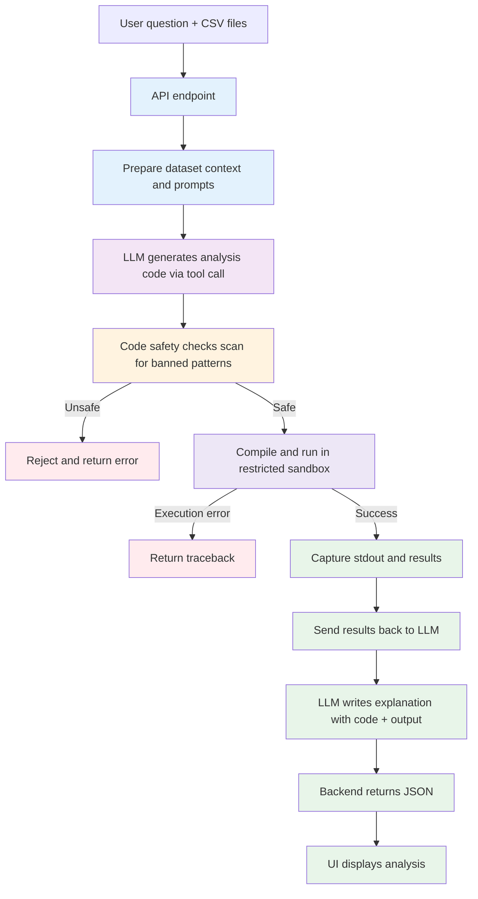

## Execution System Flow

```mermaid
flowchart TD
  A[User question + CSV files] --> B[API endpoint]
  B --> C[Prepare dataset context and prompts]
  C --> D[LLM generates analysis code via tool call]

  D --> E[Code safety checks scan for banned patterns]
  E -->|Unsafe| Z[Reject and return error]
  E -->|Safe| F[Compile and run in restricted sandbox]

  F -->|Execution error| Z2[Return traceback]
  F -->|Success| G[Capture stdout and results]

  G --> H[Send results back to LLM]
  H --> I[LLM writes explanation with code + output]
  I --> J[Backend returns JSON]
  J --> K[UI displays analysis]

  style B fill:#e3f2fd
  style C fill:#e3f2fd
  style D fill:#f3e5f5
  style E fill:#fff3e0
  style F fill:#ede7f6
  style G fill:#e8f5e9
  style H fill:#e8f5e9
  style I fill:#e8f5e9
  style J fill:#e8f5e9
  style K fill:#e8f5e9
  style Z fill:#ffebee
  style Z2 fill:#ffebee
```

