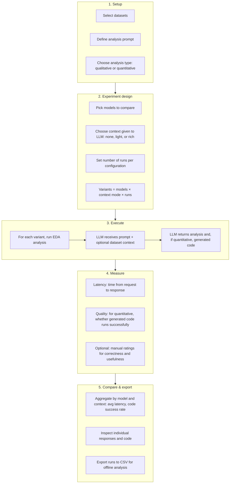

# EDA LLM Benchmark — Methodology (flowchart)

High-level methodology for benchmarking the EDA LLM tool: what we vary, what we measure, and how we use the results.

See **benchmark-page-flow.md** for a short narrative.
