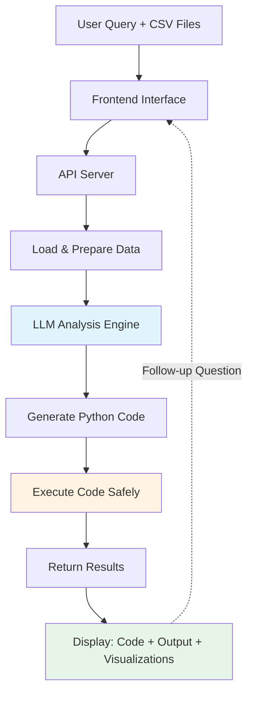
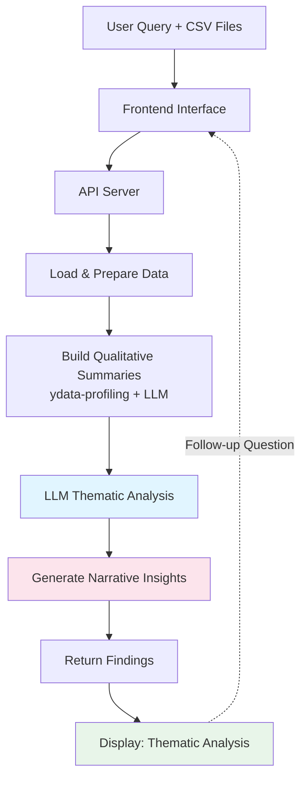

## Quantitative Analysis Flow

```mermaid
flowchart TD
  A[User Query + CSV Files] --> B[Frontend Interface]
  B --> C[API Server]
  C --> D[Load & Prepare Data]
  D --> E[LLM Analysis Engine]
  E --> F[Generate Python Code]
  F --> G[Execute Code Safely]
  G --> H[Return Results]
  H --> I[Display: Code + Output + Visualizations]
  I -.->|Follow-up Question| B

  style E fill:#e1f5ff
  style G fill:#fff4e1
  style I fill:#e8f5e9
```

## Qualitative Analysis Flow

```mermaid
flowchart TD
  A[User Query + CSV Files] --> B[Frontend Interface]
  B --> C[API Server]
  C --> D[Load & Prepare Data]
  D --> E[Build Qualitative Summaries<br/>ydata-profiling + LLM]
  E --> F[LLM Thematic Analysis]
  F --> G[Generate Narrative Insights]
  G --> H[Return Findings]
  H --> I[Display: Thematic Analysis]
  I -.->|Follow-up Question| B

  style F fill:#e1f5ff
  style G fill:#fce4ec
  style I fill:#e8f5e9
```

